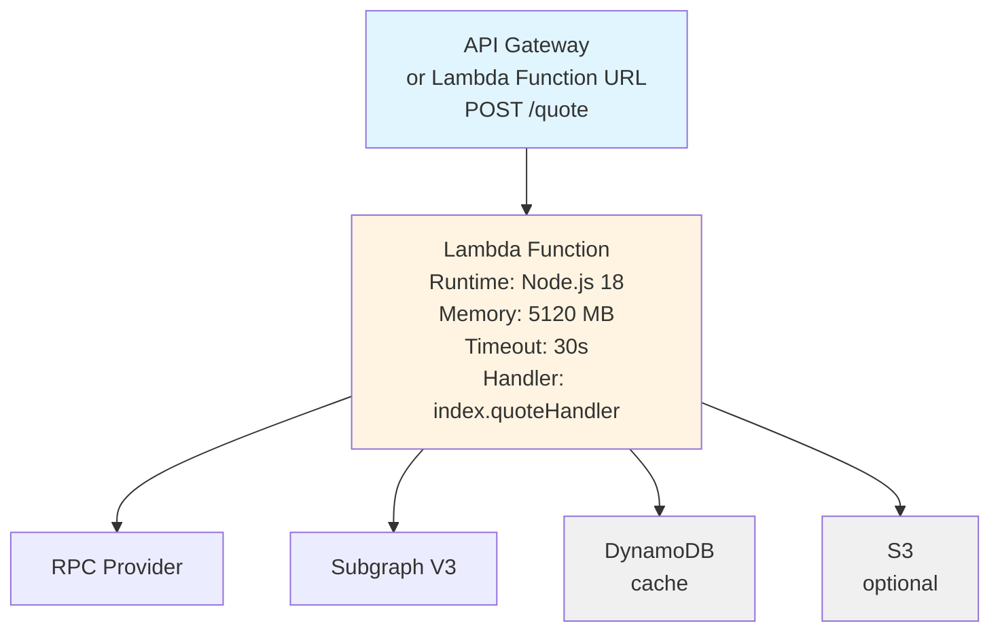

# Terraform Deployment Guide - Uniswap Routing API (V3 Only)

This guide covers deploying the simplified V3-only Uniswap Routing API for Immutable zkEVM testnet using Terraform.

## Overview

This routing API has been simplified from the original multi-chain, multi-protocol deployment to:
- **Single Chain**: Immutable zkEVM testnet (chain ID 13473)
- **Single Protocol**: Uniswap V3 only (no V2, V4, or mixed routes)
- **No Tenderly**: Uses simple `eth_estimateGas` simulation
- **No Alchemy**: Uses your custom V3 subgraph
- **Optional Caching**: DynamoDB-based caching for routes and V3 pools

## Architecture



## Prerequisites

1. **Node.js 18+** installed locally
2. **Terraform** installed in your deployment environment
3. **Immutable zkEVM testnet RPC endpoint**
4. **Deployed V3 subgraph** for Immutable zkEVM testnet
5. **AWS Account** with appropriate permissions

## Build Process

### 1. Install Dependencies

```bash
npm install
```

### 2. Build Lambda Package

```bash
npm run build:lambda
```

This will:
- Compile TypeScript to JavaScript
- Generate contract types
- Create `dist/lambda.zip` ready for deployment

The output artifact `dist/lambda.zip` contains:
- Compiled JavaScript code
- All node_modules dependencies
- No source maps or CDK binaries (excluded)

## AWS Infrastructure Requirements

### Lambda Function

```hcl
resource "aws_lambda_function" "routing_api" {
  filename         = "./dist/lambda.zip"
  function_name    = "uniswap-routing-api-zkevm"
  role            = aws_iam_role.lambda_exec.arn
  handler         = "lib/handlers/index.quoteHandler"
  source_code_hash = filebase64sha256("./dist/lambda.zip")
  runtime         = "nodejs18.x"
  timeout         = 30
  memory_size     = 5120

  environment {
    variables = {
      # Required
      ZK_EVM_TESTNET_RPC       = var.rpc_endpoint
      V3_SUBGRAPH_URL   = var.subgraph_url
      VERSION                   = "1"
      NODE_OPTIONS              = "--enable-source-maps"

      # DynamoDB Tables
      ROUTES_TABLE_NAME                        = aws_dynamodb_table.routes.name
      CACHED_ROUTES_TABLE_NAME                 = aws_dynamodb_table.cached_routes.name
      ROUTES_CACHING_REQUEST_FLAG_TABLE_NAME  = aws_dynamodb_table.routes_flag.name
      CACHED_V3_POOLS_TABLE_NAME              = aws_dynamodb_table.v3_pools.name

      # Optional
      UNICORN_SECRET = var.unicorn_secret
    }
  }

  tags = {
    Environment = "testnet"
    Chain       = "immutable-zkevm"
    Protocol    = "v3-only"
  }
}
```

### IAM Role & Policy

```hcl
resource "aws_iam_role" "lambda_exec" {
  name = "routing-api-lambda-exec-role"

  assume_role_policy = jsonencode({
    Version = "2012-10-17"
    Statement = [{
      Action = "sts:AssumeRole"
      Effect = "Allow"
      Principal = {
        Service = "lambda.amazonaws.com"
      }
    }]
  })
}

resource "aws_iam_role_policy" "lambda_policy" {
  name = "routing-api-lambda-policy"
  role = aws_iam_role.lambda_exec.id

  policy = jsonencode({
    Version = "2012-10-17"
    Statement = [
      # CloudWatch Logs
      {
        Effect = "Allow"
        Action = [
          "logs:CreateLogGroup",
          "logs:CreateLogStream",
          "logs:PutLogEvents"
        ]
        Resource = "arn:aws:logs:*:*:*"
      },
      # DynamoDB Access
      {
        Effect = "Allow"
        Action = [
          "dynamodb:PutItem",
          "dynamodb:GetItem",
          "dynamodb:Query",
          "dynamodb:DeleteItem",
          "dynamodb:UpdateItem"
        ]
        Resource = [
          aws_dynamodb_table.routes.arn,
          aws_dynamodb_table.cached_routes.arn,
          aws_dynamodb_table.routes_flag.arn,
          aws_dynamodb_table.v3_pools.arn
        ]
      }
    ]
  })
}

# Attach basic execution role
resource "aws_iam_role_policy_attachment" "lambda_basic" {
  role       = aws_iam_role.lambda_exec.name
  policy_arn = "arn:aws:iam::aws:policy/service-role/AWSLambdaBasicExecutionRole"
}
```

### DynamoDB Tables

#### Routes Cache Table

```hcl
resource "aws_dynamodb_table" "routes" {
  name         = "RoutesDB"
  billing_mode = "PAY_PER_REQUEST"
  hash_key     = "pairTradeTypeChainId"
  range_key    = "routeId"

  attribute {
    name = "pairTradeTypeChainId"
    type = "S"
  }

  attribute {
    name = "routeId"
    type = "N"
  }

  ttl {
    attribute_name = "ttl"
    enabled        = true
  }

  tags = {
    Name = "Routing API Routes Cache"
  }
}
```

#### Cached Routes Table

```hcl
resource "aws_dynamodb_table" "cached_routes" {
  name         = "RouteCachingDB"
  billing_mode = "PAY_PER_REQUEST"
  hash_key     = "pairTradeTypeChainId"
  range_key    = "protocolsBucketBlockNumber"

  attribute {
    name = "pairTradeTypeChainId"
    type = "S"
  }

  attribute {
    name = "protocolsBucketBlockNumber"
    type = "S"
  }

  ttl {
    attribute_name = "ttl"
    enabled        = true
  }

  tags = {
    Name = "Routing API Cached Routes"
  }
}
```

#### Routes Caching Flag Table

```hcl
resource "aws_dynamodb_table" "routes_flag" {
  name         = "RoutesDbCacheReqFlagDB"
  billing_mode = "PAY_PER_REQUEST"
  hash_key     = "pairTradeTypeChainId"
  range_key    = "amount"

  attribute {
    name = "pairTradeTypeChainId"
    type = "S"
  }

  attribute {
    name = "amount"
    type = "N"
  }

  ttl {
    attribute_name = "ttl"
    enabled        = true
  }

  tags = {
    Name = "Routing API Routes Flag"
  }
}
```

#### V3 Pools Cache Table

```hcl
resource "aws_dynamodb_table" "v3_pools" {
  name         = "V3PoolsCachingDB"
  billing_mode = "PAY_PER_REQUEST"
  hash_key     = "poolAddress"
  range_key    = "blockNumber"

  attribute {
    name = "poolAddress"
    type = "S"
  }

  attribute {
    name = "blockNumber"
    type = "N"
  }

  ttl {
    attribute_name = "ttl"
    enabled        = true
  }

  tags = {
    Name = "Routing API V3 Pools Cache"
  }
}
```

### API Gateway (Option 1 - Full API Gateway)

```hcl
resource "aws_apigatewayv2_api" "routing_api" {
  name          = "uniswap-routing-api"
  protocol_type = "HTTP"
}

resource "aws_apigatewayv2_integration" "lambda" {
  api_id           = aws_apigatewayv2_api.routing_api.id
  integration_type = "AWS_PROXY"
  integration_uri  = aws_lambda_function.routing_api.invoke_arn
}

resource "aws_apigatewayv2_route" "quote" {
  api_id    = aws_apigatewayv2_api.routing_api.id
  route_key = "POST /quote"
  target    = "integrations/${aws_apigatewayv2_integration.lambda.id}"
}

resource "aws_apigatewayv2_stage" "default" {
  api_id      = aws_apigatewayv2_api.routing_api.id
  name        = "$default"
  auto_deploy = true
}

resource "aws_lambda_permission" "api_gateway" {
  statement_id  = "AllowExecutionFromAPIGateway"
  action        = "lambda:InvokeFunction"
  function_name = aws_lambda_function.routing_api.function_name
  principal     = "apigateway.amazonaws.com"
  source_arn    = "${aws_apigatewayv2_api.routing_api.execution_arn}/*/*"
}

output "api_endpoint" {
  value = aws_apigatewayv2_stage.default.invoke_url
}
```

### Lambda Function URL (Option 2 - Simpler)

```hcl
resource "aws_lambda_function_url" "routing_api" {
  function_name      = aws_lambda_function.routing_api.function_name
  authorization_type = "NONE"  # or "AWS_IAM" for authenticated access

  cors {
    allow_origins     = ["*"]
    allow_methods     = ["POST"]
    allow_headers     = ["content-type"]
    max_age           = 86400
  }
}

output "function_url" {
  value = aws_lambda_function_url.routing_api.function_url
}
```

## Environment Variables

### Required

| Variable             | Description                       | Example                             |
| -------------------- | --------------------------------- | ----------------------------------- |
| `ZK_EVM_TESTNET_RPC` | RPC endpoint for zkEVM testnet    | `https://rpc.testnet.immutable.com` |
| `V3_SUBGRAPH_URL`    | Your V3 subgraph GraphQL endpoint | `https://your-subgraph/graphql`     |
| `VERSION`            | API version                       | `1`                                 |
| `NODE_OPTIONS`       | Node.js runtime options           | `--enable-source-maps`              |

### Recommended (DynamoDB Caching)

| Variable                                 | Description               | Example                  |
| ---------------------------------------- | ------------------------- | ------------------------ |
| `ROUTES_TABLE_NAME`                      | Routes cache table name   | `RoutesDB`               |
| `CACHED_ROUTES_TABLE_NAME`               | Cached routes table name  | `RouteCachingDB`         |
| `ROUTES_CACHING_REQUEST_FLAG_TABLE_NAME` | Caching flag table name   | `RoutesDbCacheReqFlagDB` |
| `CACHED_V3_POOLS_TABLE_NAME`             | V3 pools cache table name | `V3PoolsCachingDB`       |

### Optional

| Variable         | Description                              | Example             |
| ---------------- | ---------------------------------------- | ------------------- |
| `UNICORN_SECRET` | Secret for enabling debug routing config | `random-string-123` |
| `AWS_REGION`     | AWS region (auto-set by Lambda)          | `ap-southeast-2`    |

## API Usage

### Request Format

```bash
POST /quote
Content-Type: application/json

{
  "tokenInAddress": "0x...",
  "tokenInChainId": 13473,
  "tokenOutAddress": "0x...",
  "tokenOutChainId": 13473,
  "amount": "1000000000000000000",
  "type": "exactIn"
}
```

### Response Format

```json
{
  "quote": "999000000000000000",
  "quoteDecimals": "18",
  "quoteGasAdjusted": "998000000000000000",
  "gasUseEstimate": "150000",
  "gasUseEstimateQuote": "1000000000000000",
  "gasUseEstimateUSD": "0.50",
  "gasPriceWei": "100000000",
  "route": [...]
}
```

## Deployment Steps

### 1. Configure Variables

Create `terraform.tfvars`:

```hcl
rpc_endpoint = "https://rpc.testnet.immutable.com"
subgraph_url = "https://your-subgraph-url/graphql"
unicorn_secret = "your-random-secret"
aws_region = "ap-southeast-2"
```

### 2. Initialize Terraform

```bash
terraform init
```

### 3. Plan Deployment

```bash
terraform plan
```

### 4. Apply Infrastructure

```bash
terraform apply
```

### 5. Test the Endpoint

```bash
curl -X POST https://your-api-endpoint/quote \
  -H "Content-Type: application/json" \
  -d '{
    "tokenInAddress": "0x...",
    "tokenInChainId": 13473,
    "tokenOutAddress": "0x...",
    "tokenOutChainId": 13473,
    "amount": "1000000000000000000",
    "type": "exactIn"
  }'
```

## Monitoring

### CloudWatch Metrics

Key metrics to monitor:
- `Invocations`: Total number of quote requests
- `Duration`: Response time
- `Errors`: Failed requests
- `Throttles`: Rate limiting hits

### CloudWatch Logs

Lambda logs are automatically sent to:
```
/aws/lambda/uniswap-routing-api-zkevm
```

### Custom Alarms

```hcl
resource "aws_cloudwatch_metric_alarm" "high_error_rate" {
  alarm_name          = "routing-api-high-error-rate"
  comparison_operator = "GreaterThanThreshold"
  evaluation_periods  = "1"
  metric_name         = "Errors"
  namespace           = "AWS/Lambda"
  period              = "300"
  statistic           = "Sum"
  threshold           = "10"
  alarm_description   = "This metric monitors lambda errors"

  dimensions = {
    FunctionName = aws_lambda_function.routing_api.function_name
  }
}
```

## Troubleshooting

### Lambda Timeout

If quotes are timing out:
1. Increase Lambda timeout (max 900 seconds)
2. Check RPC endpoint latency
3. Verify subgraph response time
4. Ensure DynamoDB caching is enabled

### Out of Memory

If Lambda runs out of memory:
1. Increase memory allocation (currently 5120 MB)
2. Check for memory leaks in logs

### No Routes Found

If API returns "No routes found":
1. Verify V3 subgraph is returning pools
2. Check that tokens exist on zkEVM testnet
3. Ensure sufficient liquidity in pools
4. Verify token addresses are correct

### RPC Errors

If seeing RPC errors:
1. Verify `ZK_EVM_TESTNET_RPC` is correct
2. Check RPC endpoint rate limits
3. Ensure RPC endpoint supports required calls

## Differences from Original Deployment

### Removed Components

- ❌ **V2 Protocol**: No V2 pool support
- ❌ **V4 Protocol**: No V4 pool support
- ❌ **Mixed Routes**: No mixed V2/V3/V4 routes
- ❌ **Tenderly Simulation**: Uses simple eth_estimateGas
- ❌ **Alchemy Integration**: Uses custom subgraph only
- ❌ **Multi-Chain**: Single chain (zkEVM testnet) only
- ❌ **Caching Lambda**: No separate caching Lambda
- ❌ **S3 Pool Caching**: Optional, not required
- ❌ **Token Properties Table**: Simplified token validation
- ❌ **V2 Pairs Cache**: Removed

### Simplified Components

- ✅ **Single RPC Provider**: No multi-provider fallback
- ✅ **V3 Only**: Simplified routing algorithm
- ✅ **DynamoDB Caching**: Optional but recommended
- ✅ **In-Memory Caching**: Primary caching strategy

## Security Considerations

1. **API Access**: Consider using AWS_IAM authorization for Lambda Function URL or API Gateway
2. **Rate Limiting**: Implement CloudFront or API Gateway rate limiting if public
3. **VPC**: Consider placing Lambda in VPC for enhanced security
4. **Secrets**: Use AWS Secrets Manager for sensitive configuration if needed

## Updates and Maintenance

### Updating the Lambda Function

```bash
# Rebuild
npm run build:lambda

# Update Terraform
terraform apply
```

### Monitoring Subgraph Health

Ensure your V3 subgraph is:
- Up to date with latest blocks
- Returning pool data correctly
- Not rate limiting requests

## Support

For issues specific to:
- **Routing logic**: Check Uniswap smart-order-router documentation
- **zkEVM testnet**: Refer to Immutable documentation
- **Terraform**: AWS Provider documentation

## License

This deployment configuration follows the GPL license of the original Uniswap Routing API.
